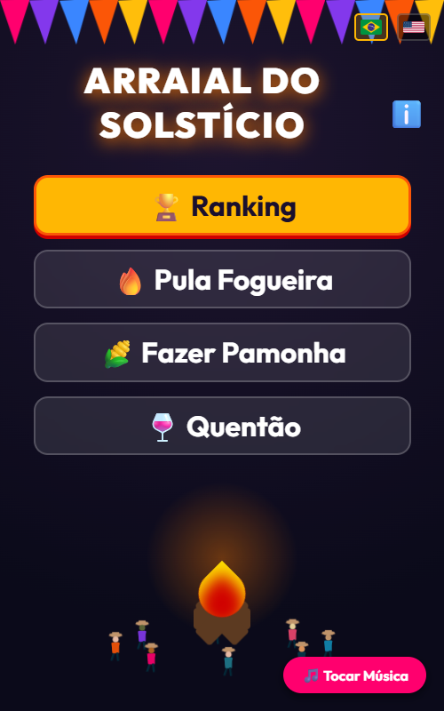
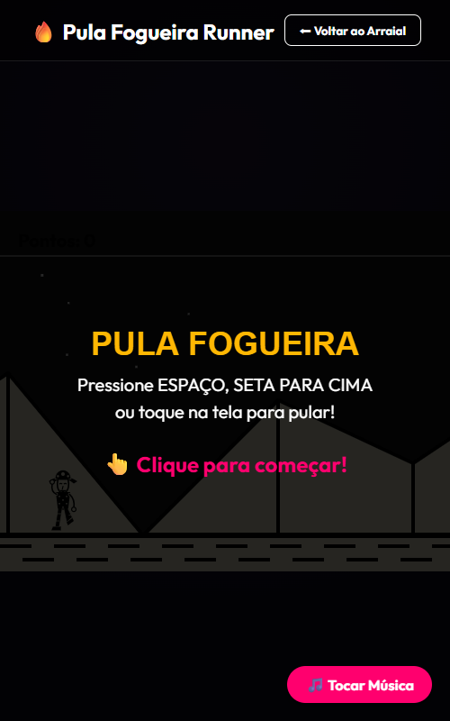
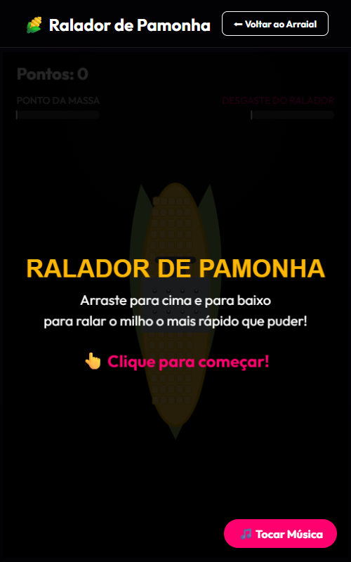
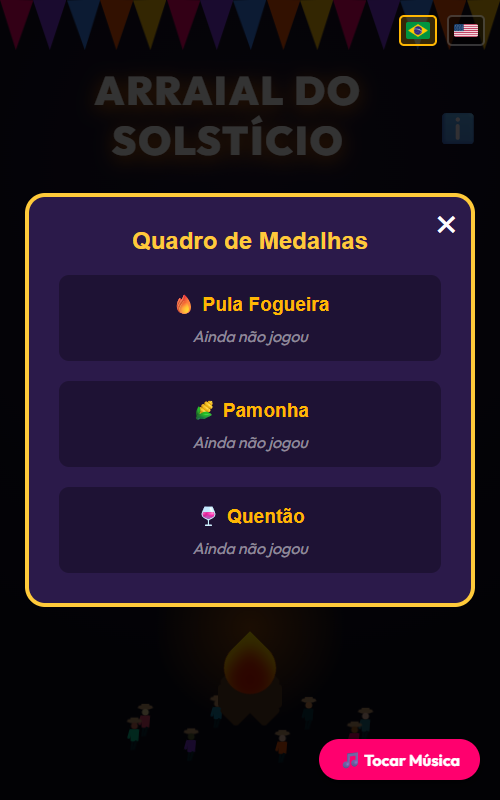

# Arraial do Solstício 🌽🔥

Bem-vindo ao **Arraial do Solstício**, uma Festa Junina interativa construída inteiramente com tecnologias web nativas! Este projeto foi criado para a *June Solstice Game Jam* do Dev.to, unindo a temática global do solstício com a nossa riquíssima cultura brasileira.

## 🎮 Jogue Agora
[**Clique aqui para jogar online!**](https://filipevieira.github.io/arraial/)

## ✨ Funcionalidades
- **Hub Interativo:** Um pátio vivo com fogueira animada, bandeirinhas, e caipiras passeando aleatoriamente pela vila. Tudo embalado com música temática junina!
- **Minigame: Pula Fogueira 🔥**: Desvie das fogueiras, pegue pamonhas e coma maçãs do amor neste endless runner super divertido.
- **Minigame: Ralando a Pamonha 🌽**: Teste sua velocidade no mouse para ralar o milho antes que a barraquinha não aguente o tranco!
- **Minigame: Equilibrando o Quentão 🍷**: Mantenha o equilíbrio do copo de quentão com movimentos precisos do mouse.
- **Sistema de Ranking 🏆**: Pontuações locais (via `localStorage`) para você competir com você mesmo e tentar garantir a medalha de Ouro!
- **Internacionalização (i18n) 🌍**: Detecção automática de idioma pelo navegador e troca em tempo real (sem refresh!) do Português para o Inglês.

## 📸 Screenshots
<p align="center">
  
  
  
  
</p>

## 🛠️ Tecnologias Utilizadas
- **Vanilla JavaScript**: Toda a lógica de estado, movimentação de personagens, física (no Quentão) e controles. Sem frameworks pesados de jogos.
- **HTML5 Canvas**: Utilizado para renderizar frame a frame a ação intensa do "Pula Fogueira" e outros minigames.
- **CSS3 / Flexbox / Grid**: Animações SVG, efeitos de Neon (text-shadow e box-shadow brilhantes), e layouts fluidos responsivos para mobile.
- **Vite**: Ferramenta de build rápida e modularização ES6+.

## 🚀 Como Rodar o Projeto Localmente

1. Clone este repositório:
   ```bash
   git clone https://github.com/filipevieira/arraial.git
   ```
2. Instale as dependências:
   ```bash
   npm install
   ```
3. Inicie o servidor de desenvolvimento local:
   ```bash
   npm run dev
   ```
4. Abra no seu navegador o endereço (ex: `http://localhost:5173`) e divirta-se!

## 💡 Ideia e Concepção
A Game Jam do DEV Challenge propôs o tema "June Solstice". O solstício de junho marca a chegada do inverno no Brasil, período tradicionalmente aquecido pelas Festas Juninas. O projeto transforma o navegador em um "Arraial", trazendo barracas, quentão, pamonha, fogueiras e muita diversão com um visual dark/neon noturno para representar o arraial iluminado.

---
Feito com 🌽 por um dev apaixonado por Festa Junina!
